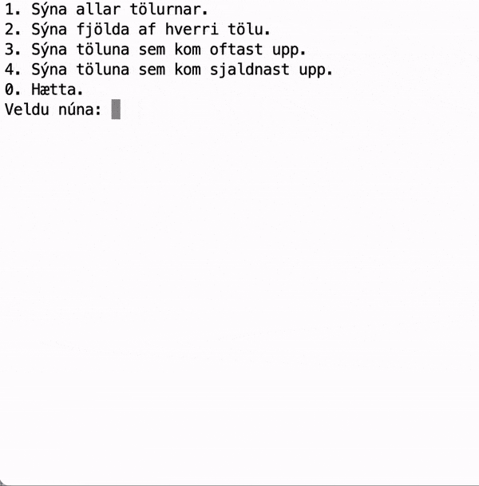

# FORR3CG - Skilaverkefni 1 (5%)

- **Verkefnið er einstaklingsverkefni**. Ef tveir eða fleiri nemendur skila sömu lausnunum er gefið 0 (núll) fyrir þær lausnir.
- **Ef kóði er tekinn af netinu** (eða öðrum álíka stöðum) skal taka það fram, benda á hvaðan hann kemur og skrifa skýringar (e. comment) við hverja línu kóðans. Sé það ekki gert verður gefið 0 (núll) fyrir verkefnið í heild.
- **Frjálst val er** um að skrifa skýringar við kóðann, að öðru leiti en þar sem liðurinn hér að ofan kallar á, en þú þarft að geta útskýrt hverja línu kóðans nákvæmlega ef beðið er um. Geti nemandi ekki útskýrt eitthvað í kóðanum sem skilað er er gefið 0 (núll) fyrir verkefnið.
- **Notið** eingöngu þær aðferðir sem kynntar hafa verið í fyrstu þremur köflum bókarinnar við lausn verkefnisins.

## Verkefnalýsing

Skrifaðu forrit sem tekur 100 (eitthundrað) tölur á bilinu 0 (núll) til og með 9 (níu) af handahófi (e. random) og setur þær í *tvívítt* fylki. Hafðu svo annað fylki (einvítt) sem heldur utan um hversu mikið er af hverri tölu, þ.e. hversu mörg núll, hversu margir einn o.s.frv.

Forritið á svo að birta valmynd þar sem notandinn getur valið um að gera eftirfarandi:

- Sjá allar 100 tölurnar, skrifist út í 10 línum, 10 tölur í línu.
- Sjá fjölda af hverjum tölustaf.
- Sjá töluna sem kom oftast upp. __*__
- Sjá töluna sem kom sjaldnast upp. __*__
- Hætta keyrslu forritsins.

__*__ ekki þarf að bregðast sérstaklega við ef tvær eða fleirri tölur koma jafn oft eða sjaldan upp. Nóg er að birta eina.

Forritið þarf svo að bregðast við með viðeigandi hætti ef notandi velur eitthvað annað en það sem er í boði í valmyndinni.

### Dæmi um virkni

## Skil á verkefninu

Skilið verkefninu á Innu. Skilin ættu að vera ein .rs skrá.

